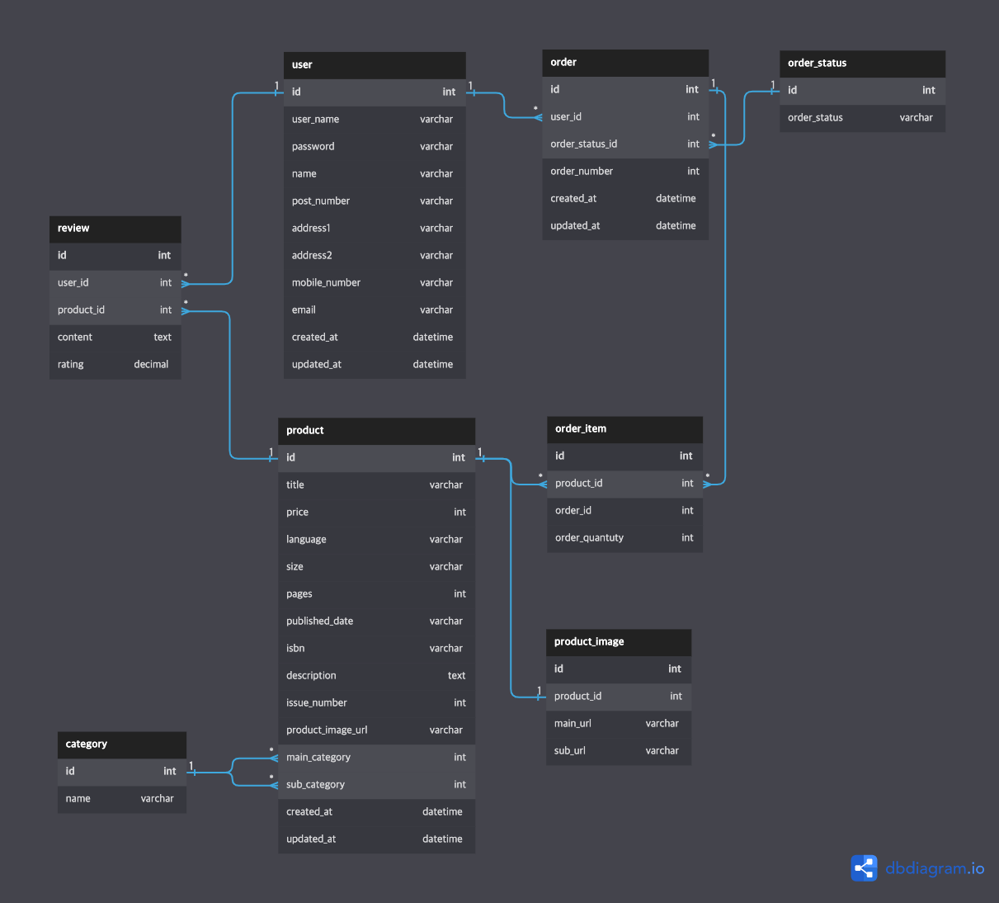

# 프로젝트 개요

* 프로젝트명: Magazine k
* 개발기간: 2022.07.18-2022.07.29
* 개발인원: Frontend 3, Backend 2 (Backend 담당)
* 기술스택: Python, Django, DjangoRestFramework, MySQL

여러가지 콘텐츠를 바탕으로한 잡지 커머스 사이트의 API 서비스를 구현했습니다. 잡지 커머스 사이트 Magazine b(https://magazine-b.co.kr/) 사이트의 기획을 모티브하였습니다.

기존의 팀 프로젝트에 DjangoRestFramework를 적용하여 리팩토링 및 고도화 하였습니다.

## 설치

요구되는 패키지는 `pip install -r requirements.txt`명령어로 설치할 수 있습니다.

## 데이터베이스 다이어그램

* `user`테이블은 회원정보를 포함합니다.
* `product`테이블은 상품정보를 포함합니다. 각 상품은 main, sub **category를** 포함하는데 이는 `category`테이블을 참조합니다. `product_image`테이블을 1:1 관계로 참조하여 필요한 이미지 데이터를 가져옵니다.
* `order`테이블은 주문정보를 포함합니다. `user`테이블을 참조하여 어떤 유저의 주문정보인지를 받아옵니다. `order_status`테이블을 참조하여 주문이 어떤 상태인지 알 수 있습니다. 장바구니의 경우 별도의 테이블을 두지 않고, 'cart'주문상태 row를 만들어 참조하도록하여 구현하였습니다. `order_item`테이블은 장바구니에 담아졌을 때 부터 주문완료 상태에 있는 상품의 정보를 포함합니다. `order`테이블을 참조하여 어떤 주문의 상품인지 확인합니다.
* `review`테이블은 회원이 구매한 상품에 대해 작성한 리뷰 정보를 포함합니다. `user`, `product`테이블을 참조하여 어떤 유저가 어떤 상품에 대해 쓴 리뷰인지 확인합니다.

## 구현

* 회원가입 및 로그인, 로그아웃
* 상품 CRRUD
* 장바구니 및 상품 주문
* 상품 리뷰 CRUD
* 테스트 코드

### 회원가입 및 로그인, 로그아웃

* 이메일과 비밀번호는 `정규 표현식`을 사용하여 유효성 검증을 시행합니다. 이메일은 기본적인 이메일의 형식을 따르도록 합니다. 비밀번호는 대소문자, 숫자, 특수문자를 포함한 8~16자리로 구성되어야 합니다.
* 비밀번호는 해싱하여 저장합니다. `bycrypt`라이브러리를 사용하여 비밀번호에 `salting`을 하여 보안 성능을 더 했습니다.
* 인증은 토큰 기반의 인증방식인 `JWT`를 사용하였습니다. Django의 `Secret key`와 `HS256`알고리즘으로 토큰을 암호화하여 전달합니다.
* 로그인은 이메일과 비밀번호를 전달받아 진행합니다. 확인과정을 거친 뒤 암호화된 토큰을 전달합니다.
* 로그아웃은 토큰을 만료시키는 방식으로 진행합니다.

### 상품 CRRUD

* 상품 목록을 조회할 수 있습니다. 기본적으로 모든 상품을 발행일 순으로 한 페이지 10개씩 전달합니다.
* 정렬 기능을 지원합니다. 최신 혹은 오래된 순, 높은 가격 혹은 낮은 가격 순으로 정렬을 할 수 있습니다.
* 카테고리 필터 기능을 지원합니다. category에 대한 정보를 `query parameter`로 전달받아 해당하는 상품의 목록을 전달합니다. 
* 상품 타이틀을 기준으로 검색 기능을 지원합니다. 대소문자를 구분하지 않고 키워드를 포함하는 상품의 목록을 전달합니다. 필터와 검색은 확장성을 고려하여 Django의 `Q object`로 구현하였습니다.
* 페이지네이션 기능을 지원합니다. `offset, limmit`개념을 활용하여 원하는 개수만큼의 상품 목록을 반환합니다.

### 장바구니 및 상품 주문

* 상품을 장바구니에 담으면 해당 상품에 대한 데이터가 `order`, `order_item`테이블에 저장됩니다. 그리고 `order_status`테이블의 `cart`데이터를 참조하게됩니다.
* 장바구니에 담긴 상품의 개수는 `path parameter`로 calculation 변수를 받아 '+' 혹은 '-'인지 판단하여, 1개 단위로 개수를 조작합니다.
* 이외에 장바구니 상품 목록을 조회하거나 삭제를 지원합니다.
* 상품 주문 결제는 현재 테스트를 위해 포인트로 결제하는 방식만 구현되었습니다. "1포인트 == 1원"으로 총 구매 금액에 해당하는 만큼 포인트가 차감되도록 구현하였습니다.
* 장바구니에 담긴 상품을 주문하면, 주문에 해당하는 `order`테이블의 데이터는 `order_status`테이블의 `delivery_completed`데이터를 참조하게 됩니다. 현재 배송과 관련된 구현이 되지 않아 배송완료 상태가 되도록 하였습니다. 그리고 해당 `order`테이블의 데이터는 주문 번호를 부여 받습니다. 주문 번호는 `uuid`를 사용하여 임의의 번호를 부여 받습니다. 
* 장바구니 및 상품 주문은 비회원은 현재 지원하지 않습니다.

### 상품 리뷰 CRUD

* 회원은 구매한 상품에 대해 리뷰를 작성할 수 있습니다. 주문 데이터가 배송완료 상태가 될 경우 리뷰작성이 활성화 됩니다.
* 회원이 구매한 하나의 상품에 하나의 리뷰만 작성할 수 있습니다.
* 리뷰의 내용을 수정할 수 있습니다. 하지만 평점의 경우 수정할 수 없도록 하였습니다.

### 테스트 코드

각 기능의 controller로 접근할 때 성공하는 경우에 대해 테스트 코드를 작성하였습니다. 테스트는 `pytest`패키지를 활용하여 구현하였습니다.

## API

각 기능별로 method, end point, description을 기록하였습니다.

### 회원 기능

| Method |   End point   | Description |
| :----: | :-----------: | :---------: |
|  POST  | /api/signup/  |  회원가입   |
|  POST  | /api/signin/  |   로그인    |
|  GET   | /api/signout/ |  로그아웃   |

### 상품 기능

| Method |                                             End point                                              |   Description    |
| :----: | :------------------------------------------------------------------------------------------------: | :--------------: |
|  POST  |                                           /api/product/                                            | 상품 데이터 생성 |
|  GET   |                                   /api/product/{int:product_id}/                                   |  상품 상세 조회  |
|  GET   | /api/product/list/?category={int:category_id}&offset=<int>&limit=<int>&keyword=<str>&sort_by=<str> |  상품 목록 조회  |
|  PUT   |                                   /api/product/{int:product_id}/                                   |  상품 정보 수정  |
| DELETE |                                   /api/product/{int:product_id}/                                   | 상품 데이터 삭제 |

### 장바구니 기능

| Method |                   End point                   |       Description       |
| :----: | :-------------------------------------------: | :---------------------: |
|  POST  |                  /api/cart/                   |   장바구니 상품 담기    |
|  GET   |                  /api/cart/                   |   장바구니 상품 조회    |
|  PUT   | /api/cart/{int:product_id}/{str:calculation}/ | 장바구니 상품 수량 조절 |
| DELETE |          /api/cart/{int:product_id}/          |   장바구니 상품 삭제    |

### 주문 기능

| Method |  End point  |  Description   |
| :----: | :---------: | :------------: |
|  GET   | /api/order/ | 주문 상품 조회 |
|  PUT   | /api/order/ |   상품 주문    |

### 리뷰 기능

| Method |               End point               |  Description   |
| :----: | :-----------------------------------: | :------------: |
|  POST  | /api/product/{int:product_id}/review/ |   리뷰 생성    |
|  GET   | /api/product/{int:product_id}/review/ | 리뷰 목록 조회 |
|  PUT   | /api/product/review/{int:review_id}/  |   리뷰 수정    |
| DELETE | /api/product/review/{int:review_id}/  |   리뷰 삭제    |