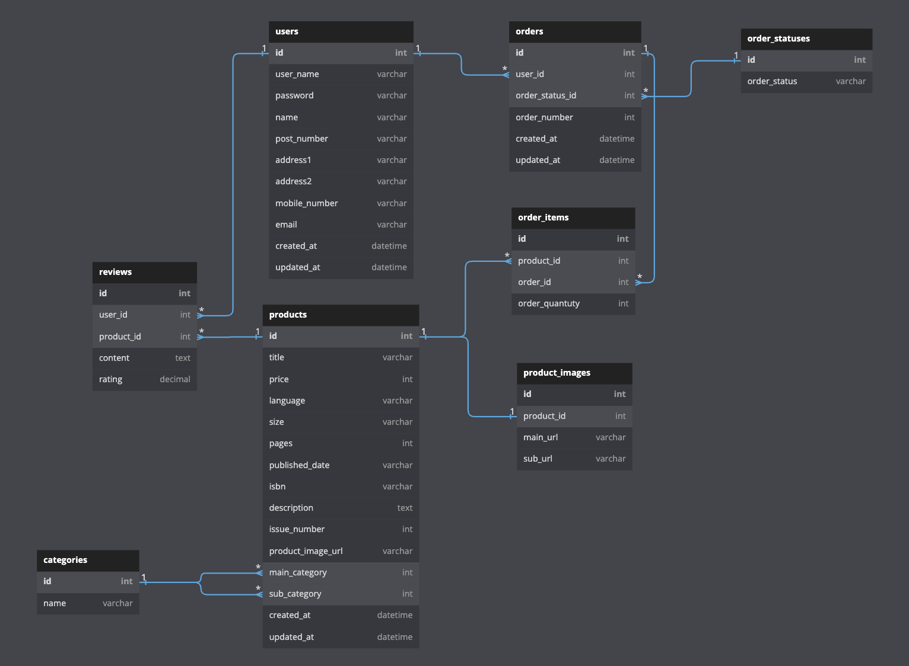

# 프로젝트 소개

* 프로젝트명: Magazine k
* 개발기간: 2022.07.18-2022.07.29
* 개발인원: Frontend 3, Backend 2 (Backend 담당)
* 기술스택: Python, Django, MySQL, Miniconda

여러가지 콘텐츠를 바탕으로한 잡지 커머스 사이트를 구현해보았습니다. 짧게 정해진 프로젝트 기한에 맞추기 위해 기존의 커머스 사이트 Magazine b(https://magazine-b.co.kr/)사이트의 기획을 클론하였습니다.

## 구현
---
* 회원가입 및 로그인 기능 구현
* 상품리스트 조회, 정렬, 필터, 검색 및 페이지네이션 구현
* 상품 상세페이지 및 리뷰 기능 구현
* 장바구니 및 상품 주문 기능 구현

### 데이터베이스 다이어그램
---


### 담당 구현 사항
---
* 상품 필터 및 검색 구현
```python
category = int(request.GET.get('category', 1))
keyword  = request.GET.get('keyword', '').upper()

if category:
    filter_options |= Q(main_category=category)
    filter_options |= Q(sub_category=category)

if keyword:
    filter_options &= Q(title__icontains=keyword)
```
상품리스트 조회 시 쿼리 매개변수를 받아 Django Q Object를 이용하여 카테고리별 조회와 상품 검색요청에 응답할 수 있도록 구현하였습니다.
* 상품 정렬 구현
```python
sort_by  = request.GET.get('sort_by', 'latest_issue')

sort_options = {
    'latest_issue' : '-issue_number',
    'oldest_issue' : 'issue_number',
    'high_price'   : '-price',
    'low_price'    : 'price',
}
```
기본적으로 상품을 최신순으로 정렬하되 클라이언트의 요구에 따라 쿼리 매개변수를 받아 발행일 순 혹은 가격 순으로 정렬할 수 있도록 하였습니다.
* 상품 페이지 네이션 구현
```python
offset   = int(request.GET.get('offset', 0))
limit    = int(request.GET.get('limit', 0))

result = [{
    'total_count' : products.count(),
    'products' : [{
        'product_id'    : product.id,
        'title'         : product.title,
        'issue_number'  : product.issue_number,
        'main_category' : product.main_category.name,
        'price'         : product.price,
        'main_img_url_1': product.productimage.main_url,
        'main_img_url_2': product.productimage.sub_url,
    }for product in products[offset:offset+limit]]
}]
```
최종적으로 상품에 대한 정보를 응답해 줄 때 한 페이지에 표시되는 상품의 개수를 클라이언트가 원하는 개수에 offset, limite 개념을 활용하여 응답할 수 있도록 구현하였습니다.

* 장바구니 및 상품 주문 기능 구현 (트랜잭션 적용)

```python
with transaction.atomic():
    if not cart_order.exists():
        new_order = Order.objects.create(
            user            = user,
            order_status_id = OrderStatusEnum.CART.value
        )
        OrderItem.objects.create(
            product        = selected_product,
            order          = new_order,
            order_quantity = DEFAULT_VALUE,
        )

    if not cart_products.exists():
        OrderItem.objects.create(
        product        = selected_product,
        order          = cart_order.first(),
        order_quantity = DEFAULT_VALUE,
    )
```

이번 프로젝트의 기획상 장바구니에 대한 모델이 별도로 존재하지 않고 주문 모델에서 주문 상태를 통해 장바구니와 주문을 구별하도록 하였습니다. 그래서 장바구니에 담는 즉시 주문과 주문 상품 모델에 데이터가 함께 업데이트 되는데, 작업 도중 에러로 인해 주문만 생성되고 주문 상품이 생성되지 않는 상황을 막기 위해 트랜젝션을 적용시켜 일련의 과정이 성공적으로 커밋되지 않으면 롤백되도록 구현하였습니다.

이외의 상품 조회, 삭제는 ORM을 통해 데이터를 조작하도록 구현하였습니다.

## API
---
* User

|   End point   	| HTTP Method 	| Description 	| Status 	|
|:-------------:	|:-----------:	|:-----------:	|:------:	|
|  /member/join 	|     POST    	|   회원가입  	|  Done  	|
| /member/login 	|     POST    	|    로그인   	|  Done  	|

* Product

|          End point         	| HTTP Method 	| Description 	| Status 	|
|:--------------------------:	|:-----------:	|:-----------:	|:------:	|
|          /products         	|     GET     	| 제품 리스트 조회 	|  Done  	|
| /products/int:product_id 	|     GET     	|  제품 상세 조회  	|  Done  	|

* Order

|         End point        	|     HTTP Method     	|             Description             	| Status 	|
|:------------------------:	|:-------------------:	|:-----------------------------------:	|:------:	|
|       /orders/cart       	|         GET         	|            장바구니 조회            	|  Done  	|
| /orders/<int:product_id> 	| POST, PATCH, DELETE 	| 장바구니 상품 추가, 수량 조정, 삭제 	|  Done  	|
| /orders | PATCH | 상품 구매 | Done |

* Review

|                    End point                   	| HTTP Method 	|     Description     	| Status 	|
|:----------------------------------------------:	|:-----------:	|:-------------------:	|:------:	|
|        /products/int:product_id/reviews        	|  GET, POST  	| 리뷰 생성, 불러오기 	|  Done  	|
| /products/int:product_id/reviews/int:review_id 	|    DELETE   	|      리뷰 삭제      	|  Done  	|